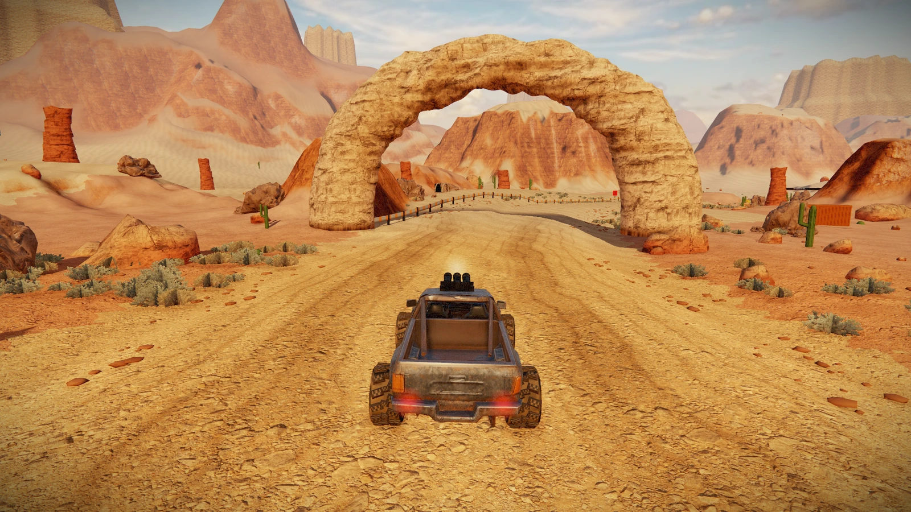
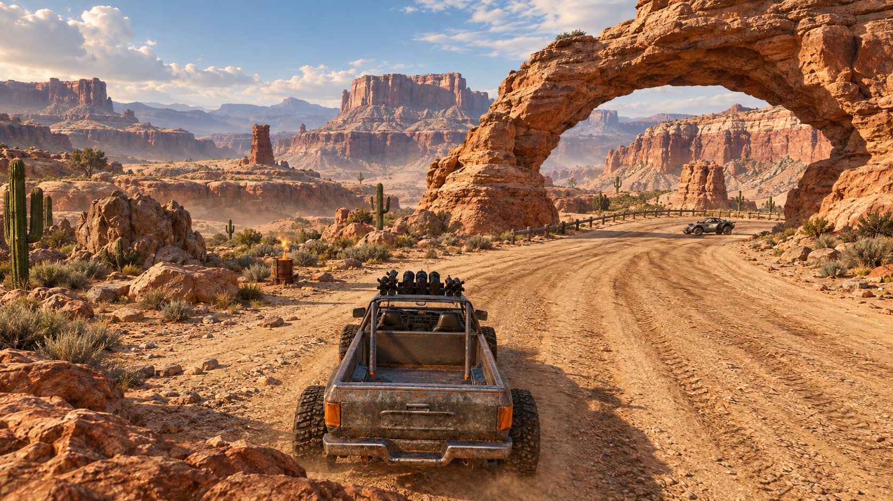

# Sunstrike Canyon: background and arch

The benchmark emphasizes continuous eroded stone, sedimentary cliff shelves, broken mesa silhouettes, talus slopes and cooler distant haze.

Implemented a fully volumetric sandstone arch with a hollow drive-through opening, irregular bedding and asymmetric erosion. Its source is `erodedRockArchGeo` in `src/world/kit.js`; the game builds this mesh directly. The former stacked cylinders and cap blocks remain available for other stages. The existing separately placed Sandscape arch model is retained.

Background terrain now has stepped mesa profiles and eroded rims. Fourteen additional volumetric mesa formations extend the skyline, with scanned cliff texturing, geological bands and cooler distance haze. Cliff material detail persists farther from the camera. No paid asset generation was used.

Validation: all 23 test groups passed, including new checks for the arch's hollow opening, solid legs and collision footprint, and the distant mesa placement. High and Low browser renders checked separately. Physical-phone performance has not been measured.

## Actual game render

## Benchmark

Created using the built-in imagegen tool, with the user's annotated screenshot as the reference. This image is an art target, not a gameplay capture.

### Exact prompt

Create an AAA-quality visual benchmark for Sunstrike Canyon off-road racing, using the attached gameplay screenshot as composition reference. Preserve the rear chase camera, battered armed off-road truck centered bottom, broad dusty driveable track curving through the large sandstone arch on right, arid canyon identity. Replace the blocky stacked-brick arch with a continuous natural eroded 3D sandstone arch, asymmetric weathered pillars, deep layered strata, chipped edges, undercut opening with shaded underside, believable geological mass, no masonry. Improve the background from smooth conical mounds into complex stepped mesas with broken cliff faces, gullies, talus slopes, layered sedimentary ledges and distant hazy blue-violet ridgelines. Physically plausible warm late afternoon sun with neutral stone highlights and cool soft shadows, restrained orange saturation. Fine gritty road, sparse desert sage. Real-time game art target, photoreal materials and models, readable racing route. Remove HUD and red annotation arrow. Landscape 16:9.
