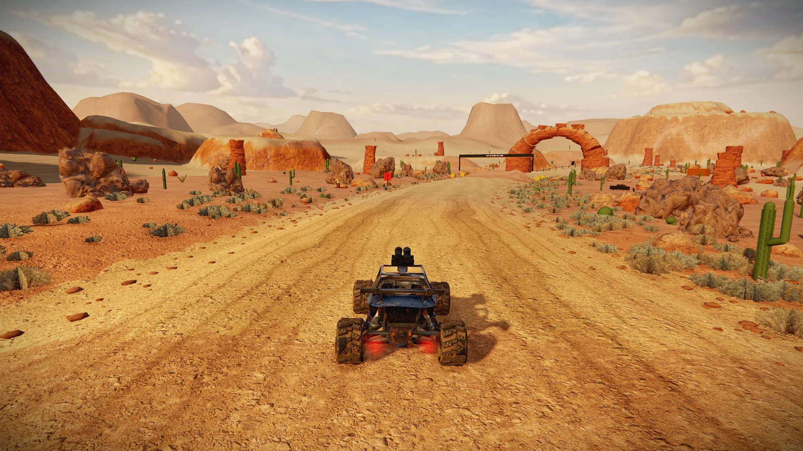
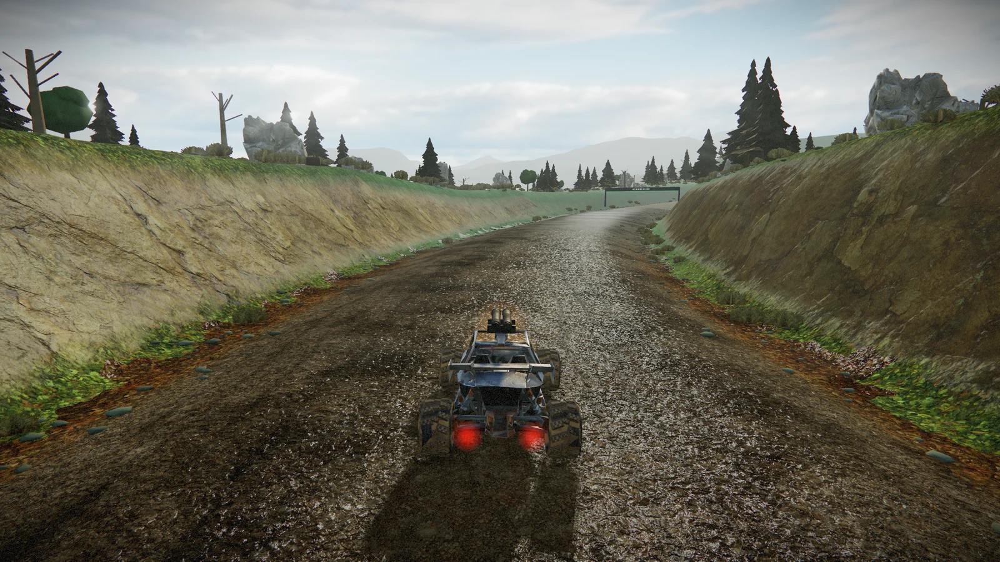
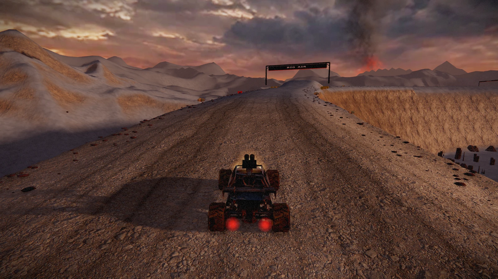
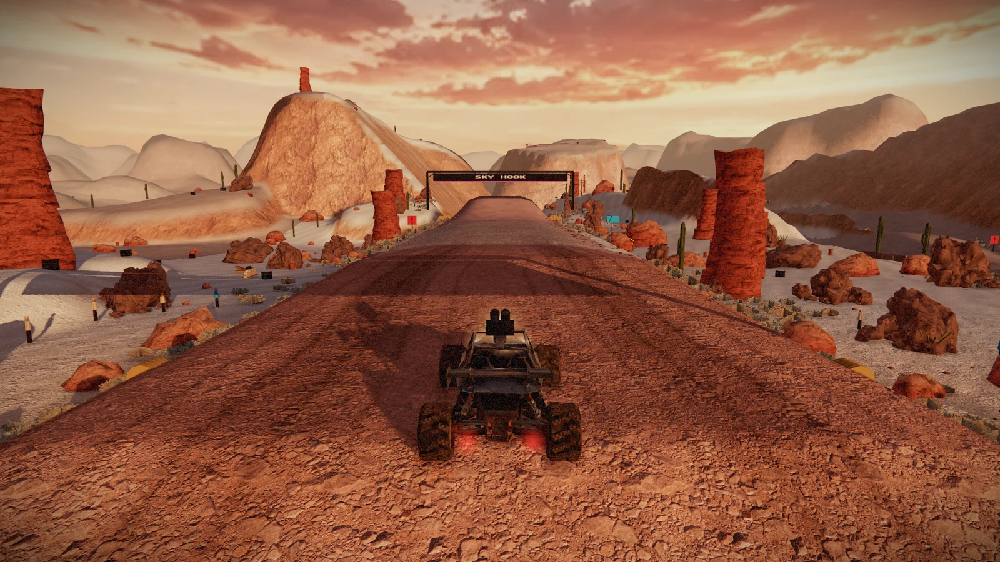

# Remaining stages: environment quality pass

Applied the accepted Proving Grounds treatment across Canyon, Forest, Caldera Run and Thunder Park on 2026-09-22.

Each stage now has a distinct generated panoramic sky that also supplies reflection lighting, scanned ground color and normal detail, scanned rock clusters, smaller roadside grass and loose gravel. High and Ultra quality use contact ambient occlusion. Low and Medium retain simplified rocks, smaller textures and reduced decorative density. Collision coverage stays consistent across quality settings.

## Canyon

Warm sandstone atmosphere, textured rock arch, ochre scanned outcrops and sagebrush.

## Forest

Cool alpine sky, scanned leaf litter, textured damp road shoulders and softer pine illumination. Mud reflections are restrained to improve surface readability.

## Caldera Run

Ash sky, dark basalt outcrops and cooler fill light to keep the vehicle readable. Lava retains its existing emissive treatment.

## Thunder Park

Muted amber and violet sunset, warm rock clusters and sagebrush. Reduced saturation keeps the horizon and vehicle from washing out into orange.

## Validation

All 23 test groups passed, including all-stage road, shortcut, checkpoint and grid clearance; rock-cluster collision containment; and quality-tier consistency. Browser checks found no shader or asset errors on all four stages in High and Low. Forest also completed High → Low → High switching and an 844 × 390 viewport check.

| Stage | High: draw calls / triangles at s=140 | Low: draw calls / triangles near landmark |
|---|---:|---:|
| Canyon | 170 / 1.635M | 93 / 309K at s=940 |
| Forest | 167 / 2.066M | 112 / 451K at s=1460 |
| Caldera Run | 172 / 911K | 96 / 292K at s=1380 |
| Thunder Park | 197 / 1.657M | 96 / 320K at s=980 |

These are fixed-camera desktop browser checks, not a physical-phone performance measurement. High and Low counts use different course positions and are not a controlled performance comparison. The screenshots above are actual High-quality game renders, not image-generation targets.

Sky images are LDR panoramas, not HDR captures. [Generation prompts and provenance](../../assets/sky/stage-panorama-prompts.md). [Forest texture credit](../../assets/ground/forest-LICENSE.md). Existing scanned rock and quarry texture credits remain with their assets.
